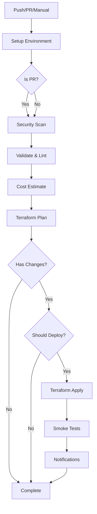

# CI/CD Pipeline Setup Guide

## Overview

This guide will help you set up the GitHub Actions CI/CD pipeline for the Terraform Azure infrastructure project.

## Prerequisites

- GitHub repository with Actions enabled
- Azure subscription and service principal
- Terraform Cloud account (optional, for remote state)
- Infracost account (optional, for cost estimation)
- Slack webhook (optional, for notifications)

## Required GitHub Secrets

Configure the following secrets in your GitHub repository settings:

### Azure Authentication Secrets
```
ARM_CLIENT_ID          # Azure Service Principal App ID
ARM_CLIENT_SECRET      # Azure Service Principal Password
ARM_SUBSCRIPTION_ID    # Azure Subscription ID
ARM_TENANT_ID          # Azure AD Tenant ID
```

### Terraform Backend Secrets
```
BACKEND_RESOURCE_GROUP    # Resource group for Terraform state (e.g., rg-terraform-state)
BACKEND_STORAGE_ACCOUNT  # Storage account for Terraform state (e.g., stterraformstate12345)
BACKEND_CONTAINER        # Container name for Terraform state (e.g., tfstate)
```

### Application Secrets
```
ADMIN_EMAIL             # Admin email for alerts and notifications
```

### Optional Integration Secrets
```
INFRACOST_API_KEY      # Infracost API key for cost estimation
SLACK_WEBHOOK_URL      # Slack webhook URL for notifications
```

## Setup Steps

### 1. Create Azure Service Principal

```bash
# Create service principal with Contributor role
az ad sp create-for-rbac \
  --name "terraform-cicd-sp" \
  --role Contributor \
  --scopes /subscriptions/YOUR_SUBSCRIPTION_ID \
  --sdk-auth

# Save the output JSON - you'll need these values for GitHub secrets
```

### 2. Create Terraform State Backend

```bash
# Create resource group
az group create \
  --name rg-terraform-state \
  --location eastus2

# Create storage account (use unique name)
STORAGE_ACCOUNT="stterraformstate$RANDOM"
az storage account create \
  --name $STORAGE_ACCOUNT \
  --resource-group rg-terraform-state \
  --location eastus2 \
  --sku Standard_LRS \
  --encryption-services blob

# Create container
az storage container create \
  --name tfstate \
  --account-name $STORAGE_ACCOUNT \
  --auth-mode login

echo "Storage Account Name: $STORAGE_ACCOUNT"
```

### 3. Configure GitHub Secrets

1. Go to your GitHub repository
2. Navigate to Settings → Secrets and variables → Actions
3. Add each secret listed above using "New repository secret"

### 4. Set Up Environments

Create GitHub environments for deployment protection:

1. Go to Settings → Environments
2. Create three environments: `dev`, `staging`, `prod`
3. For `prod` environment:
   - Enable "Required reviewers"
   - Add protection rules as needed
   - Configure deployment branches (only `main`)

### 5. Update Configuration Files

Update the following placeholders in the repository:

#### In `.github/workflows/terraform-cicd.yml`:
- No changes needed (uses secrets)

#### In `.github/CODEOWNERS`:
- Replace `YOUR_GITHUB_USERNAME` with your GitHub username
- Replace team names with actual GitHub teams or usernames

#### In `.github/dependabot.yml`:
- Replace `YOUR_GITHUB_USERNAME` with your GitHub username

#### In `README.md`:
- Replace `YOUR_GITHUB_USERNAME` with your GitHub username

#### In `environments/*/backend.tf`:
- Update `storage_account_name` with your actual storage account name

#### In `environments/*/terraform.tfvars`:
- Replace `YOUR_OFFICE_IP/32` with your actual office/home IP address
- Update `admin_email` with your email address

### 6. Optional: Set Up Infracost

1. Sign up at [infracost.io](https://www.infracost.io)
2. Get your API key from the dashboard
3. Add `INFRACOST_API_KEY` to GitHub secrets

### 7. Optional: Set Up Slack Notifications

1. Create a Slack incoming webhook:
   - Go to your Slack workspace settings
   - Navigate to "Incoming Webhooks"
   - Create a new webhook for your channel
2. Add `SLACK_WEBHOOK_URL` to GitHub secrets

## Pipeline Triggers

The CI/CD pipeline is triggered by:

- **Push to main**: Deploys to production
- **Push to develop**: Deploys to staging
- **Pull requests**: Runs validation, security scans, and plan
- **Manual dispatch**: Allows manual deployment with environment selection
- **Schedule**: Weekly drift detection (Mondays at 2 AM UTC)

## Pipeline Features

### Security Scanning
- **TFSec**: Terraform security scanner
- **Checkov**: Infrastructure as code security scanner
- **Trivy**: Comprehensive security scanner
- Results uploaded to GitHub Security tab

### Validation & Linting
- Terraform format check
- Terraform validation
- TFLint with Azure rules

### Cost Estimation
- Infracost integration for PR comments
- Shows cost breakdown and monthly estimates

### Deployment Protection
- Environment-based approvals
- Plan artifacts saved for apply
- Smoke tests after deployment
- Automatic rollback on failure

### Notifications
- Slack notifications for deployment status
- GitHub deployment tracking
- PR comments with plan output
- Issue creation on pipeline failure

## Workflow Diagram



## Monitoring the Pipeline

### View Pipeline Status
- Go to Actions tab in GitHub repository
- Filter by workflow: "Terraform CI/CD Pipeline"
- Click on a run to see detailed logs

### Status Badges
The README includes dynamic status badges that show:
- Current pipeline status
- Security scan status
- License information
- Terraform version
- Azure cloud indicator

### Deployment History
- Check the Deployments section in GitHub
- View environment-specific deployment history
- Track deployment frequency and success rate

## Troubleshooting

### Common Issues

1. **Authentication Failed**
   - Verify Azure service principal credentials
   - Check secret names match exactly
   - Ensure service principal has correct permissions

2. **Backend State Locked**
   - Break the lock: `terraform force-unlock LOCK_ID`
   - Check for concurrent pipeline runs

3. **Plan Shows Unexpected Changes**
   - Run drift detection workflow
   - Check for manual changes in Azure portal
   - Verify variable values in tfvars files

4. **Security Scan Failures**
   - Review security findings in Security tab
   - Add exceptions for false positives
   - Update module code to fix vulnerabilities

### Debug Mode

To enable debug logging:
1. Go to Settings → Secrets and variables → Actions
2. Add a variable: `ACTIONS_RUNNER_DEBUG` = `true`
3. Add a variable: `ACTIONS_STEP_DEBUG` = `true`

## Best Practices

1. **Branch Protection**
   - Protect `main` and `develop` branches
   - Require PR reviews before merge
   - Require status checks to pass

2. **Secret Rotation**
   - Rotate Azure service principal credentials quarterly
   - Update secrets without pipeline disruption
   - Use Azure Key Vault for runtime secrets

3. **Cost Management**
   - Review Infracost reports before approval
   - Set up budget alerts in Azure
   - Use auto-destroy for dev environments

4. **Security**
   - Review security scan results regularly
   - Keep Terraform and providers updated
   - Enable Azure Policy for compliance

## Support

For issues with the pipeline:
1. Check the workflow logs in GitHub Actions
2. Review this setup guide
3. Check GitHub Actions documentation
4. Open an issue in the repository

---

**Note**: Remember to never commit secrets or sensitive information to the repository. Always use GitHub Secrets or Azure Key Vault for sensitive data.